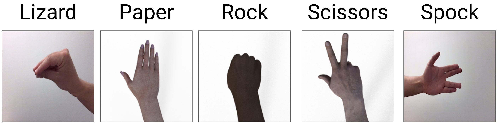

# Rock-Paper-Scissors-Lizard-Spock-using-tensorflowjs
Creating a tensorflow model in tensorflowjs for a popular game using transfer learning.

Using mobilenet for doing transfer learning for a popular game from sitcom. The training for the model is done in the web itself, where the page initially asks for input data which is captured in the web itself using webcam. Then the model is trained and the user can then start the prediction for the live images.

